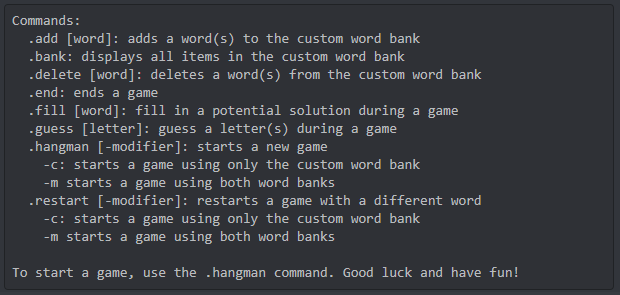

# Discord Hangman Bot

This project is a discord bot written in Python using the `discord.py` library. 

The Discord Hangman Bot is an easy to host bot that provides server with a user-friendly way to play hangman games. Each server is able to edit a word bank exclusive to their servers to meet their own interests and games are customizable with the bots various flags.

Use the .help command to get a list of all available commands.

## Requirements

- Docker

## Installation
1. Create a discord bot account and copy the [token](https://discordpy.readthedocs.io/en/stable/discord.html)

2. Clone the repo:

```bash
git clone https://github.com/steven-diep/hangman_bot.git
```

3. Create a copy of `Dockerfile.example`:

```bash
cp Dockerfile.example Dockerfile
```

4. Fill in your token in `Dockerfile`, replacing the \<FMI> with your token:

```bash
# Set environment variables
ENV DISCORD_TOKEN <FMI>
```

 5. Build the Docker image::

```bash
docker build -t hangman_bot .
```

6. Run the container:

```bash
docker run hangman_bot
```

## Usage

To get a full list of commands, use the command in your Discord server:

```bash
.help
```

Output:




## Links

* [Discord Developer Portal - Documentation](https://discord.com/developers/docs/intro)
* [discord.py](https://pypi.org/project/discord.py/)
* [discord.py Documentation](https://discordpy.readthedocs.io/en/latest/)


## License
[MIT](https://choosealicense.com/licenses/mit/)
